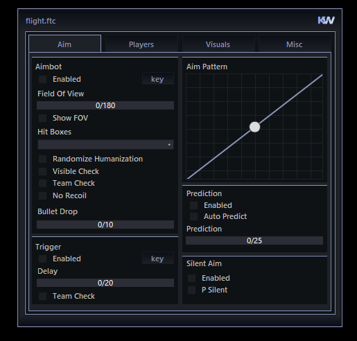
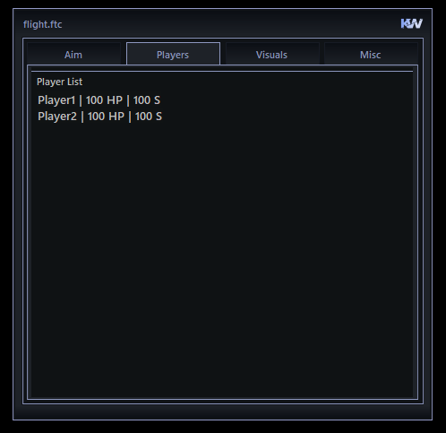
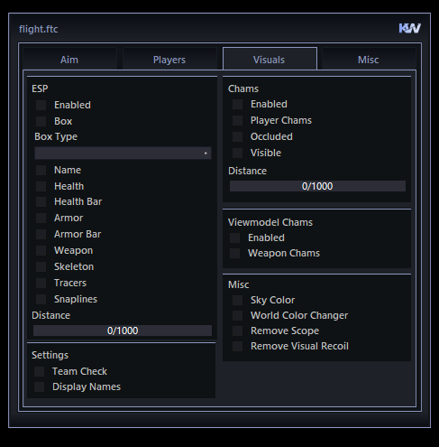
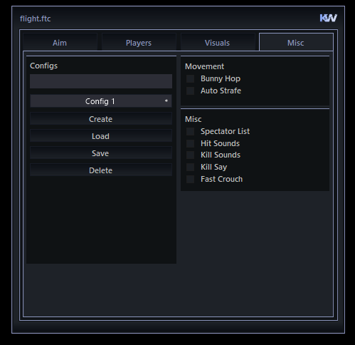

# cheat menu for winforms

Just a UI that can be used for cheats and such, following nuget packages below were used.

- **CuoreUI** - UI Controls
- **SiticoneUI** - UI Controls
- **Guna2UI** - UI Controls 
- **Costura.Fody** - DLL Embed (Allows you to just have an .exe file)

This menu includes 2 custom controls, a custom graph and a custom slider.

Player Tab was lazy but everything else is much better.

  

  
